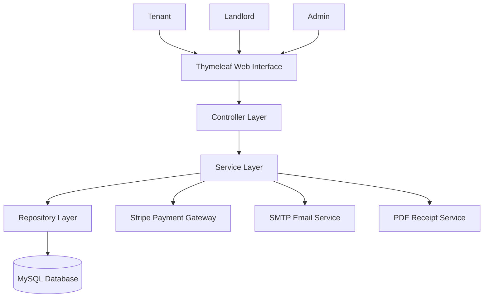
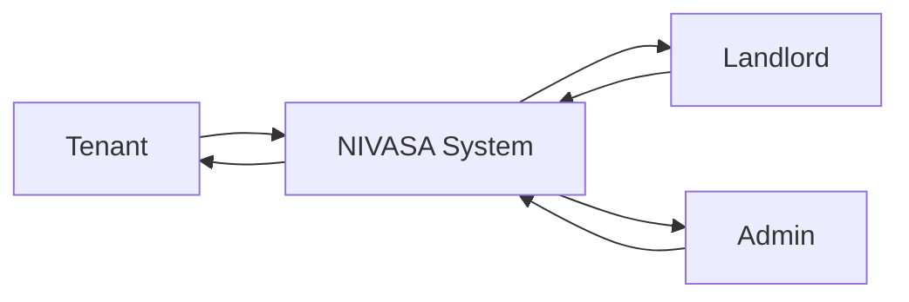
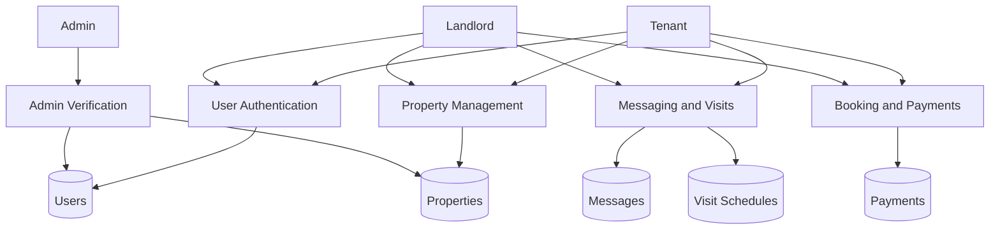
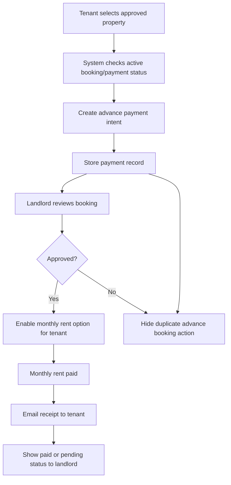
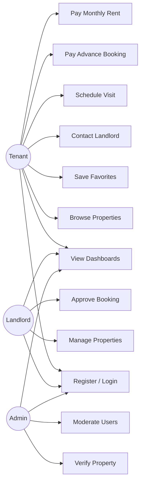
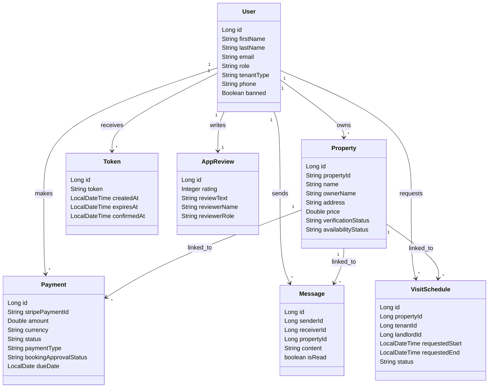
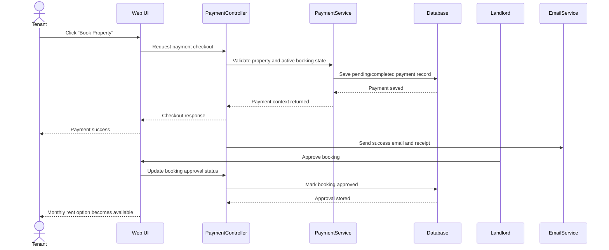

# A Project Report On

# NIVASA

## A Secure Web-Based Rental House Management and Property Verification System

**Prepared On:** April 7, 2026  
**Reference Format:** Based on the structure of `demo blackbook.pdf` shared by the user  
**Note:** Replace all bracketed placeholders before final college submission or PDF export.

---

## Title Page

Submitted in partial fulfillment of the requirements for the award of  
**[Degree / Diploma Name] in [Department Name]**

Submitted to  
**[College / Institute Name]**

Submitted by  
**[Student Name]**  
**[Enrollment / Roll Number]**

Guided by  
**[Guide Name]**

Academic Year  
**[2025-2026 / 2026-2027]**

---

## CERTIFICATE

This is to certify that the project report entitled **"NIVASA: A Secure Web-Based Rental House Management and Property Verification System"** has been successfully completed by **[Student Name]**, student of **[Class / Department / Institute Name]**, in partial fulfillment of the requirements for the award of **[Degree / Diploma Name]**.

The work embodied in this report is a genuine project carried out during the academic year **[Academic Year]** under the guidance of **[Guide Name]**.

| Name / Designation | Signature |
|---|---|
| Project Guide: [Guide Name] | __________ |
| Head of Department: [HOD Name] | __________ |
| External Examiner: [External Name] | __________ |
| Principal: [Principal Name] | __________ |

---

## ACKNOWLEDGEMENT

I express my sincere gratitude to **[Guide Name]** for valuable guidance, encouragement, and consistent support during the development of the project **NIVASA**. Their suggestions helped in shaping the technical design, implementation quality, and overall presentation of the system.

I also thank the **Head of Department**, respected faculty members, and the **Principal of [Institute Name]** for providing the opportunity and environment required to complete this work successfully.

I am grateful to my classmates, friends, and family members for their motivation and support throughout the project duration.

---

## ABSTRACT

NIVASA is a full-stack web-based rental housing platform developed to simplify and secure the process of discovering, verifying, booking, and managing rental properties. The system is designed for three primary roles: tenant, landlord, and administrator. It reduces the limitations of traditional rental workflows such as fake listings, fragmented communication, manual payment follow-up, and poor transparency in booking approval.

The platform allows landlords to add and manage properties, upload images and verification documents, and monitor tenant interactions. Tenants can register, browse approved properties, mark favorites, contact landlords, schedule visits, pay advance booking amounts, receive receipt emails, and track monthly rent status after landlord approval. Administrators can review pending properties, verify users, moderate records, and maintain trust within the system.

The application is implemented using **Java 17**, **Spring Boot**, **Spring Security**, **Spring Data JPA**, **Thymeleaf**, and **MySQL**. Supporting integrations include **Stripe** for payment processing, **SMTP email services** for notifications, and **PDF generation tools** for receipt creation. The current implementation also includes scheduling support for reminders, late-fee evaluation, payout handling, and booking refund workflows.

NIVASA demonstrates a practical and scalable approach for modern rental property management by combining property listing, approval, communication, payment, reminders, and administrative control into one integrated system.

---

## CONTENTS

1. CHAPTER NO. 01 : INTRODUCTION  
1.1 Introduction  
1.2 Scope of Project  
1.3 Objectives  

2. CHAPTER NO. 02 : LITERATURE SURVEY  
2.1 Literature Review  
2.2 Background and Evolution  
2.3 Existing System  
2.4 Proposed System  
2.5 Need of Proposed System  

3. CHAPTER NO. 03 : DEFINE PROBLEM  
3.1 Problem Definition  
3.2 Technology Description  

4. CHAPTER NO. 04 : REQUIREMENT ANALYSIS  
4.1 Hardware Requirement  
4.2 Software Requirement  
4.3 Functional Requirement  
4.4 Non-Functional Requirement  
4.5 Feasibility Study  
4.5.1 Operational Feasibility  
4.5.2 Technical Feasibility  
4.5.3 Economical Feasibility  
4.5.4 Schedule Feasibility  

5. CHAPTER NO. 05 : DESIGN OF SYSTEM  
5.1 System Architecture  
5.2 Data Flow Diagram  
5.2.1 DFD Level 0  
5.2.2 DFD Level 1  
5.2.3 DFD Level 2  
5.3 UML Diagram  
5.3.1 Use Case Diagram  
5.3.2 Class Diagram  
5.3.3 Sequence Diagram  
5.3.4 Activity Diagram  
5.4 Database Design Summary  

6. CHAPTER NO. 06 : IMPLEMENTATION OF SYSTEM  
6.1 Module Design  
6.2 Workflow Implementation  
6.3 Snapshot Checklist  

7. CHAPTER NO. 07 : SYSTEM TESTING  
7.1 Software Testing  
7.1.1 Unit Testing  
7.1.2 Integration Testing  
7.1.3 System Testing  
7.1.4 Acceptance Testing  
7.2 Test Cases  
7.3 Verification Result  

8. CHAPTER NO. 08 : CONCLUSION AND FUTURE SCOPE  
8.1 Conclusion  
8.2 Future Scope  

9. CHAPTER NO. 09 : REFERENCES AND BIBLIOGRAPHY

---

## IMAGE INDEX

1. System Architecture  
2. DFD Level 0  
3. DFD Level 1  
4. DFD Level 2  
5. Use Case Diagram  
6. Class Diagram  
7. Sequence Diagram  
8. Activity Diagram  

---

## TABLE INDEX

1. Hardware Requirements  
2. Software Requirements  
3. Functional Requirements  
4. Non-Functional Requirements  
5. Test Cases  

---

# CHAPTER NO. 01 : INTRODUCTION

## 1.1 Introduction

Housing search and rental management are essential activities in urban and semi-urban environments, but the process often remains fragmented. Tenants usually depend on scattered advertisements, informal brokers, unverified property details, and repeated manual communication. Landlords face difficulties in presenting trusted listings, handling tenant queries, arranging visits, tracking payments, and maintaining proper records. Administrators or platform operators require a way to supervise user activity, verify submitted information, and preserve platform quality.

NIVASA is designed to solve these issues through a centralized digital platform. It brings together property discovery, landlord listing management, admin approval, tenant communication, visit scheduling, advance booking payment, monthly rent tracking, receipt generation, and email notifications in one integrated web application.

The system follows a role-based model:

- **Tenant** users search approved properties, save favorites, contact landlords, schedule visits, make advance and monthly rent payments, and review booking or payment status.
- **Landlord** users create and manage property listings, upload documents, approve booking requests, view active rent status, and monitor wallet or payout information.
- **Administrator** users verify submitted properties, review student verification requests, monitor records, and maintain trust and policy compliance across the platform.

The result is a secure and user-oriented rental system that improves transparency, reduces manual dependency, and supports smoother decision-making for all stakeholders.

## 1.2 Scope of Project

The scope of NIVASA covers the core lifecycle of property rental management within a web-based environment. The current implementation includes:

- User registration, login, and role-based access control
- Tenant, landlord, and admin dashboard experiences
- Property creation, editing, media upload, and verification
- Property browsing, detail viewing, and favorite management
- Tenant-landlord communication through messaging
- Visit request scheduling and reminders
- Advance booking payment workflow
- Landlord approval before monthly rent payment is enabled
- Monthly rent payment tracking and landlord visibility of paid or pending status
- Receipt generation and email delivery to tenants
- Reviews, support pages, and policy pages
- Scheduler-based automation for reminders and payment lifecycle handling

This scope makes the project suitable for academic demonstration, prototype deployment, and future expansion into a larger production-ready rental platform.

## 1.3 Objectives

The main objectives of the NIVASA system are:

1. To provide a trusted digital platform for rental property discovery and management.
2. To reduce fake or misleading property listings through admin verification and moderation.
3. To simplify interactions between tenants and landlords by providing structured messaging and dashboard workflows.
4. To allow secure and transparent handling of advance booking and monthly rent payments.
5. To improve booking control by ensuring monthly rent is enabled only after landlord approval.
6. To provide receipt generation and payment email support for transaction visibility.
7. To support reminders and automation for visits, rent follow-up, and payment lifecycle events.
8. To make the overall rental process faster, safer, and easier to track.

---

# CHAPTER NO. 02 : LITERATURE SURVEY

## 2.1 Literature Review

The rental housing domain has gradually shifted from manual broker-led processes to digital property discovery platforms. Existing studies and software trends in e-commerce, property portals, and management systems show that users value trust, convenience, verified information, and transparent transactions.

The literature and industry trend analysis around online property systems typically highlight the following aspects:

- **Digital listing platforms** help tenants discover properties faster, but many focus only on search and advertisement.
- **Property management systems** often help landlords manage rent and maintenance, but may not support public discovery or admin moderation.
- **Online payment systems** increase convenience but require strong validation, status tracking, and secure gateways.
- **Role-based web applications** improve security and workflow separation for different stakeholders.
- **Automated notifications and reminders** improve consistency in appointments, follow-ups, and recurring payments.

From these patterns, it becomes clear that a strong rental platform should not stop at listing display. It should support verification, communication, booking, payment, reminders, and reporting within one consistent system. NIVASA is designed with that integrated approach.

## 2.2 Background and Evolution

Earlier rental processes were mostly handled through local brokers, paper records, word-of-mouth recommendations, and telephone communication. While simple, these methods created several challenges:

- limited visibility of available properties
- poor standardization of listing details
- delayed response between tenants and landlords
- no centralized record of interactions or payments
- little protection against fake or incomplete information

As internet usage increased, online property portals improved search convenience but still left several gaps in verification, payment visibility, and post-booking workflow management. Modern users now expect more than browsing. They expect an end-to-end experience that includes trust, identity checks, messaging, approval flow, digital receipts, and alerts.

NIVASA follows this next-step approach by combining multiple rental operations into a single role-based system.

## 2.3 Existing System

In the existing or traditional approach, rental management usually suffers from one or more of the following issues:

- property details are scattered across different channels
- listing authenticity is difficult to verify
- communication happens outside the platform and becomes hard to track
- booking agreements are informal or delayed
- payment status is not always visible to both parties
- tenants and landlords rely heavily on manual follow-up
- admins have limited control over trust and compliance

Even in some digital platforms, the focus remains limited to search and contact. Important workflows such as booking approval, monthly rent visibility, scheduled reminders, document-backed property verification, and receipt sharing are often weak or missing.

## 2.4 Proposed System

The proposed system, NIVASA, is a full-stack web application that provides:

- property upload and admin verification
- role-based login for tenant, landlord, and admin
- secure browsing of approved properties
- favorites and messaging features
- visit scheduling and reminders
- advance booking payment and approval workflow
- monthly rent payment only after booking approval
- receipt generation and email sharing with tenants
- landlord-side visibility of active rent payment status
- admin supervision for property and user verification

This approach turns a fragmented rental process into a structured digital workflow.

## 2.5 Need of Proposed System

There is a strong need for a system like NIVASA because rental platforms must balance speed with trust. Tenants want accurate listings, clear payments, and reliable communication. Landlords want verified demand, structured booking flow, and better visibility into tenant activity. Admins need moderation tools to prevent low-quality or harmful platform behavior.

NIVASA addresses this need by:

- improving listing reliability through verification
- reducing duplicate or unclear payment actions
- making approval and rent status visible in dashboards
- keeping transaction evidence through receipts and email
- supporting growth through modular architecture and automation

---

# CHAPTER NO. 03 : DEFINE PROBLEM

## 3.1 Problem Definition

The core problem addressed by NIVASA is the lack of a unified, trustworthy, and transparent digital process for rental housing management. Traditional rental workflows often involve disconnected activities such as property discovery, landlord communication, visit arrangement, payment discussion, and booking follow-up. Because these processes happen through multiple channels, they create risk, confusion, and delay.

The main problem statements can be summarized as follows:

- Tenants do not always get reliable and verified property information.
- Landlords do not have a structured system to manage listings, responses, and bookings.
- Payment handling is often manual or poorly tracked.
- There is little visibility into whether rent is paid, pending, approved, or duplicated.
- Users lack centralized communication records and reminders.
- Platform operators need moderation and approval workflows to maintain trust.

Therefore, a secure, role-based, web-based rental management system is required to connect listing, approval, communication, payment, and status tracking in one platform.

## 3.2 Technology Description

NIVASA is developed using **Java 17** as the main programming language for backend implementation. The project uses **Spring Boot 4.0.0** to simplify application setup and development, while **Spring MVC** manages routing, controller logic, and request handling. For security, **Spring Security** is used to provide authentication, authorization, and role-based access control for tenants, landlords, and administrators.

For database operations, **Spring Data JPA** is used as the ORM layer, and **MySQL** is used as the relational database for storing users, properties, payments, messages, and other records. **Thymeleaf** is used as the server-side template engine to render dynamic web pages, while **HTML, CSS, and JavaScript** are used to build the user interface and improve client-side interaction.

From the frontend perspective, NIVASA provides a user-friendly web interface with separate pages for tenants, landlords, and administrators. The frontend includes pages such as the home page, login and registration forms, tenant dashboard, landlord dashboard, admin pages, property detail pages, payment pages, and messaging screens. **HTML** defines the structure of these pages, **CSS** is used for layout and styling, and **JavaScript** adds interactivity such as button actions, form handling, checkout behavior, and dynamic page updates. In combination with **Thymeleaf**, the frontend can display real-time data from the backend in a simple and organized way.

With respect to programming languages, **Java** is the primary language used in the project. It is an object-oriented and platform-independent language that is well suited for building secure, maintainable, and scalable web applications. In NIVASA, Java is used to implement controllers, services, entities, repositories, security configuration, payment processing logic, email handling, and scheduler-based automation. For the presentation layer, **HTML**, **CSS**, and **JavaScript** are used. HTML provides the basic structure of the web pages, CSS improves the visual appearance and layout, and JavaScript enhances the user experience by enabling dynamic and interactive behavior in the browser. The project also works with **SQL** through MySQL for storing and retrieving persistent data, although most database interaction is handled through Spring Data JPA instead of writing raw queries manually.

The project uses **Maven** for dependency management and build execution. **Spring Mail** is integrated for OTP delivery, notifications, reminders, and payment-related emails. **Stripe Java SDK** is used to support secure online payment processing for advance booking and monthly rent. For receipt generation and PDF-related operations, the system uses **iText** and **PDFBox**.

These technologies were selected because they are reliable, widely used, well documented, and suitable for building a structured full-stack web application for academic as well as practical use.

---

# CHAPTER NO. 04 : REQUIREMENT ANALYSIS

## 4.1 Hardware Requirement

### Table 1: Hardware Requirements

| Category | Specification |
|---|---|
| Processor | Intel i3 / Ryzen 3 or above |
| RAM | Minimum 8 GB recommended for development |
| Storage | Minimum 20 GB free disk space |
| Display | Standard monitor with browser support |
| Network | Internet required for mail, maps, and payment integration |

### Client-Side Hardware

| Category | Specification |
|---|---|
| Processor | Dual-core or above |
| RAM | Minimum 4 GB |
| Browser Device | Desktop or laptop with modern web browser |
| Input | Keyboard and mouse / touchpad |

## 4.2 Software Requirement

### Table 2: Software Requirements

| Category | Requirement |
|---|---|
| Operating System | Windows 10/11, Linux, or macOS |
| JDK | Java 17 |
| Framework | Spring Boot 4.0.0 |
| Build Tool | Maven |
| Database | MySQL |
| Template Engine | Thymeleaf |
| IDE | IntelliJ IDEA / VS Code / Eclipse |
| Browser | Google Chrome / Microsoft Edge |
| Version Control | Git |
| Payment Gateway | Stripe |
| Mail Service | SMTP-enabled mail account |

## 4.3 Functional Requirement

### Table 3: Functional Requirements

| ID | Requirement |
|---|---|
| FR-01 | The system shall allow user registration and role selection. |
| FR-02 | The system shall provide secure login and logout. |
| FR-03 | The system shall allow landlords to add, edit, and manage properties. |
| FR-04 | The system shall allow image and document uploads for property verification. |
| FR-05 | The system shall allow admins to approve or reject submitted properties. |
| FR-06 | The system shall allow tenants to browse approved properties and view details. |
| FR-07 | The system shall support favorite properties for tenants. |
| FR-08 | The system shall support tenant-landlord messaging linked to properties. |
| FR-09 | The system shall support scheduling and managing property visits. |
| FR-10 | The system shall support advance booking payments. |
| FR-11 | The system shall prevent duplicate advance payment for the same active booking. |
| FR-12 | The system shall allow landlord approval after booking payment. |
| FR-13 | The system shall enable monthly rent payment only after landlord approval. |
| FR-14 | The system shall show whether the current monthly rent is paid or pending. |
| FR-15 | The system shall email payment receipts to tenants. |
| FR-16 | The system shall support reviews, password reset, and support pages. |
 continue tommorow....
## 4.4 Non-Functional Requirement

### Table 4: Non-Functional Requirements

| Category | Description |
|---|---|
| Security | The system must protect user accounts through authentication and role-based authorization. |
| Reliability | Payment and booking state changes should be consistent and traceable. |
| Usability | The interface should provide clear dashboards and simple navigation for each role. |
| Performance | The platform should respond efficiently for moderate academic or prototype usage. |
| Maintainability | The codebase should remain modular through layered architecture. |
| Scalability | New modules such as analytics or mobile apps should be addable in future. |
| Availability | Core pages should remain operational whenever server and database are available. |
| Portability | The system should run on common operating systems with Java and MySQL support. |

## 4.5 Feasibility Study

### 4.5.1 Operational Feasibility

NIVASA is operationally feasible because it solves real problems faced by tenants, landlords, and admins. The workflows are close to real-world rental activity and are easy to understand. Dashboards, forms, and status messages reduce manual confusion. The separation of roles improves clarity of responsibility.

### 4.5.2 Technical Feasibility

The project is technically feasible because it uses standard open-source technologies such as Java, Spring Boot, Thymeleaf, and MySQL. These technologies are well supported and suitable for creating role-based enterprise-style applications. The project already includes controllers, services, repositories, entities, and templates that fit this architecture successfully.

### 4.5.3 Economical Feasibility

The system is economically feasible because the main development stack is open source. Development can be completed using common hardware and free community tools. Initial deployment cost remains relatively low for an academic or prototype environment. Paid services such as production email or payment integration can be added later as needed.

### 4.5.4 Schedule Feasibility

The project is schedule-feasible because the implementation can be divided into manageable modules such as authentication, property management, admin verification, messaging, visits, and payments. This modular breakdown supports phased development and testing within a college project timeline.

---

# CHAPTER NO. 05 : DESIGN OF SYSTEM

## 5.1 System Architecture

NIVASA follows a layered architecture based on the Spring Boot MVC pattern. This helps separate user interface logic, controller routing, business services, data repositories, and persistent storage.

### Figure 1: System Architecture



### Architectural Layers

- **Presentation Layer:** HTML, CSS, JavaScript, and Thymeleaf templates
- **Controller Layer:** request mapping and user flow handling
- **Service Layer:** business logic, validations, reminders, and payment workflows
- **Repository Layer:** database access through JPA repositories
- **Database Layer:** MySQL storage for users, properties, payments, messages, reviews, tokens, and visits

## 5.2 Data Flow Diagram

### 5.2.1 DFD Level 0

At Level 0, NIVASA is viewed as a single system interacting with external actors.



**Inputs:** registration data, property details, messages, visit requests, payments, approval actions  
**Outputs:** approved listings, booking status, payment receipts, reminders, dashboard updates

### 5.2.2 DFD Level 1

At Level 1, the system is broken into major sub-processes.



### 5.2.3 DFD Level 2

Level 2 below focuses on the booking and rent payment flow, which is one of the key distinguishing features of NIVASA.



## 5.3 UML Diagram

### 5.3.1 Use Case Diagram



### 5.3.2 Class Diagram



### 5.3.3 Sequence Diagram

The following sequence shows the advance booking payment and approval workflow.



### 5.3.4 Activity Diagram

The following activity diagram describes monthly rent eligibility after booking approval.

```mermaid
flowchart TD
    A[Start] --> B[Advance booking already paid?]
    B -- No --> C[Show advance booking option]
    B -- Yes --> D[Landlord approved booking?]
    D -- No --> E[Hide monthly rent option]
    D -- Yes --> F[Check current rent cycle status]
    F -- Paid --> G[Show "View Rent Payment"]
    F -- Pending --> H[Show "Pay Monthly Rent"]
    H --> I[Payment success]
    I --> J[Send receipt email to tenant]
    J --> K[Show paid status on landlord dashboard]
    G --> L[End]
    K --> L
    E --> L
    C --> L
```

## 5.4 Database Design Summary

The database is designed around the following core entities:

- `users`
- `properties`
- `payments`
- `messages`
- `visit_schedules`
- `confirmation_token`
- `app_reviews`
- chatbot-related tables

Important relationships in the design:

- One landlord can own multiple properties.
- One tenant can make multiple payments for different properties and rent cycles.
- One property can have multiple messages and visit requests.
- One user can have token records for confirmation or password workflows.
- One user can submit one application review in the current model.

---

# CHAPTER NO. 06 : IMPLEMENTATION OF SYSTEM

## 6.1 Module Design

### 6.1.1 Authentication and User Management Module

This module handles registration, login, role selection, password management, and protected access control. Spring Security is used to ensure that only authorized users access role-specific routes. Student tenants can be subjected to verification before full activation.

### 6.1.2 Property Management Module

Landlords can add properties with details such as address, city, state, pincode, property type, rent amount, and amenities. They can upload property images and verification documents. Property records also store verification status and availability state, which makes it possible for admins to control listing quality.

### 6.1.3 Tenant Experience Module

Tenants can browse approved properties, view detail pages, save favorites, contact landlords, and schedule property visits. Dashboard cards help tenants monitor booked properties and payment status. This module improves transparency and makes the search-to-book journey easier to manage.

### 6.1.4 Messaging and Visit Scheduling Module

The system supports direct messaging between tenants and landlords, with optional property linkage for context. Visit scheduling allows a tenant to request a visit slot, after which the landlord can review, approve, or respond to the request. Reminder scheduling services help reduce missed visits.

### 6.1.5 Payment and Billing Module

The payment module is one of the most important parts of the application. It supports:

- advance booking payments
- monthly rent payments
- deposit-related payment categories
- payment lifecycle state tracking
- receipt generation
- payout and refund scheduling support

Recent improvements in this workflow include:

- payment amount validation performed on the server side
- duplicate advance booking prevention
- monthly rent enablement only after landlord approval
- landlord dashboard visibility for paid or pending rent
- receipt attachment sharing with tenant email
- idempotent payment success handling to reduce duplicate side effects

### 6.1.6 Landlord Operations Module

Landlords can manage property records, upload verification assets, view property status, review booking activity, approve tenant booking requests, and track current rent status of active tenants. The dashboard now clearly indicates whether the current monthly rent for an approved booking is paid or still pending.

### 6.1.7 Admin Monitoring Module

Admins maintain platform quality through property review, student verification, and moderation-related dashboard functions. This improves trustworthiness and helps reduce misuse of the system.

### 6.1.8 Review and Support Module

The system includes application reviews, FAQ pages, privacy policy, terms and conditions, contact support, and optional chatbot-related support components.

## 6.2 Workflow Implementation

### 6.2.1 Property Onboarding Workflow

1. Landlord registers and logs in.
2. Landlord adds property details and uploads images/documents.
3. Property enters a pending verification state.
4. Admin reviews and approves or rejects the listing.
5. Approved property becomes visible to tenants.

### 6.2.2 Advance Booking and Approval Workflow

1. Tenant opens an approved property.
2. Tenant selects booking payment.
3. System validates whether an active advance booking already exists.
4. If not, the advance payment is processed and stored.
5. Receipt and payment confirmation are sent to the tenant.
6. Landlord reviews the booking and either approves or rejects it.
7. If approved, the tenant becomes eligible to pay monthly rent.

### 6.2.3 Monthly Rent Workflow

1. Tenant enters dashboard or property detail page.
2. System checks the approved booking and current rent cycle.
3. If current cycle is unpaid, the system shows the monthly rent action.
4. If the cycle is already paid, the system shows the payment detail view instead of another payment option.
5. Landlord dashboard reflects whether the current rent is paid or pending.

### 6.2.4 Messaging and Visit Workflow

1. Tenant contacts landlord from property detail.
2. System opens property-linked conversation.
3. Tenant requests a visit schedule.
4. Landlord reviews the request and responds.
5. Reminder services notify users for upcoming visits.

## 6.3 Snapshot Checklist

To match the style of a printed blackbook, add screenshots for the following pages when preparing the final Word or PDF version:

1. Home page
2. Registration page
3. Login page
4. Tenant dashboard
5. Landlord dashboard
6. Admin pending properties page
7. Property detail page
8. Add property form
9. Payment checkout page
10. Payment success page
11. Payment history page
12. Conversations page
13. Visit schedule page
14. Favorite properties page

---

# CHAPTER NO. 07 : SYSTEM TESTING

## 7.1 Software Testing

Testing ensures that each part of the system behaves correctly and that combined workflows remain stable.

### 7.1.1 Unit Testing

Unit testing focuses on individual methods or components in isolation. In a future enhanced testing suite, business rules such as booking eligibility, rent-cycle status evaluation, and payment lifecycle calculations should be tested independently.

### 7.1.2 Integration Testing

Integration testing verifies the interaction between controller, service, repository, and database layers. In NIVASA, this is especially important for:

- authentication and role redirection
- property creation and admin approval
- payment record creation and dashboard updates
- email and receipt generation hooks

### 7.1.3 System Testing

System testing verifies the application as a complete product. The focus is on real user workflows such as tenant search, landlord property onboarding, payment success, approval handling, and admin moderation.

### 7.1.4 Acceptance Testing

Acceptance testing ensures the system satisfies the expected needs of tenants, landlords, and administrators. The platform is acceptable if it provides trusted property access, safe payment handling, booking visibility, and usable dashboard flows.

## 7.2 Test Cases

### Table 5: Test Cases

| Test Case ID | Scenario | Expected Result |
|---|---|---|
| TC-01 | New user registers as tenant or landlord | Account is created and role-based flow is available |
| TC-02 | Verified user logs in | User reaches correct dashboard based on role |
| TC-03 | Landlord adds a new property | Property is stored with pending verification state |
| TC-04 | Admin approves property | Property becomes visible to tenant browsing pages |
| TC-05 | Tenant marks property as favorite | Property appears in favorite list |
| TC-06 | Tenant sends message to landlord | Conversation is stored and visible to both users |
| TC-07 | Tenant pays advance booking amount | Payment is recorded and duplicate booking option is hidden |
| TC-08 | Landlord approves paid booking | Tenant becomes eligible for monthly rent payment |
| TC-09 | Tenant pays current monthly rent | Receipt is sent and landlord sees paid status |
| TC-10 | Tenant tries duplicate advance or rent payment in same cycle | System blocks duplicate or invalid payment action |

## 7.3 Verification Result

The latest technical verification performed on **April 7, 2026** included:

- successful compilation using `mvn -q -DskipTests compile`
- successful test execution using `mvn -q test`

This confirms that the current codebase builds correctly and that the application context test passes successfully in the working environment.

---

# CHAPTER NO. 08 : CONCLUSION AND FUTURE SCOPE

## 8.1 Conclusion

NIVASA is a complete rental house management platform that combines property listing, verification, dashboard management, communication, booking, digital payment, receipt sharing, and rent status tracking in a single system. It addresses practical challenges of the rental domain such as trust, manual coordination, unclear payment state, and scattered communication.

The project demonstrates a strong understanding of full-stack web development using enterprise-oriented tools and structured architecture. The current implementation is meaningful not only as an academic project, but also as a solid base for future real-world enhancement.

## 8.2 Future Scope

The following future enhancements can make the system even stronger:

1. Mobile application support for Android and iOS
2. More advanced search filters and property recommendations
3. Digital rental agreement and e-signature support
4. Real-time notification system using WebSocket or push services
5. Cloud-based image and document storage
6. Better analytics dashboards for landlords and admins
7. Maintenance complaint and service request management
8. Stronger automated test coverage
9. Multi-city scaling and data insights
10. AI-based support improvements for tenant queries and recommendations

---

# CHAPTER NO. 09 : REFERENCES AND BIBLIOGRAPHY

1. Spring Boot Reference Documentation  
2. Spring Security Reference Documentation  
3. Spring Data JPA Documentation  
4. Thymeleaf Official Documentation  
5. MySQL Reference Manual  
6. Stripe Developer Documentation  
7. Oracle Java Documentation for Java 17  
8. Apache Maven Documentation  
9. iText Documentation  
10. PDFBox Documentation  
11. Pressman, R. S. and Maxim, B. R., *Software Engineering: A Practitioner's Approach*  
12. Sommerville, I., *Software Engineering*  

---

## Final Submission Notes

- Replace the title page placeholders with your institute details.
- Add screenshots from the running application to the Snapshot Checklist section.
- If your college requires page numbers, certificate formatting, or logo placement, apply those in Word after copying this content.
- A suitable final academic title for submission is: **"NIVASA: A Secure Web-Based Rental House Management and Property Verification System"**
